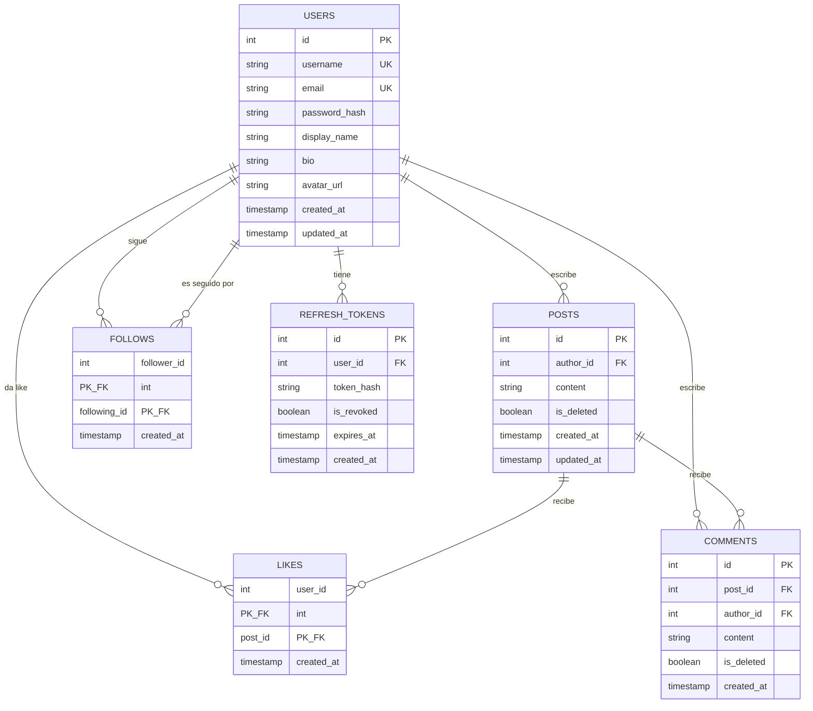

# Documentación de Base de Datos
Referencia técnica del esquema relacional de niko-net (Sprint 1).

## Decisiones de diseño

- **Uso de soft delete (`is_deleted`) en `posts` y `comments`**: Se optó por un borrado lógico en lugar de físico (`DELETE` en SQL) para preservar el historial de interacciones y evitar que "likes" o referencias en la base de datos queden huérfanas o rompan métricas. 
- **`FOLLOWS` y `LIKES` tienen clave primaria compuesta**: Dado que estas tablas modelan relaciones de "muchos a muchos" con unicidad intrínseca (un usuario no puede seguir a alguien dos veces o dar múltiples likes al mismo post), usar ambas claves foráneas como primaria compuesta garantiza la integridad de datos sin necesidad de generar un `id` artificial.
- **Propósito de `REFRESH_TOKENS` y `is_revoked`**: Esta tabla almacena los tokens de refresco emitidos para sesiones prolongadas de usuarios. El campo `is_revoked` permite invalidar manualmente un token (por ejemplo, en caso de compromiso de cuenta o cierre de sesión) sin necesidad de eliminar permanentemente el registro de auditoría.

## Diagrama de relaciones



## Tabla de relaciones

| Tabla | Se relaciona con | Tipo | Descripción |
|---|---|---|---|
| USERS | POSTS | 1 a muchos | Un usuario puede escribir muchas publicaciones |
| USERS | COMMENTS | 1 a muchos | Un usuario puede escribir muchos comentarios |
| USERS | FOLLOWS | 1 a muchos | Un usuario puede seguir a muchos otros |
| USERS | LIKES | 1 a muchos | Un usuario puede dar like a muchos posts |
| USERS | REFRESH_TOKENS | 1 a muchos | Un usuario puede tener varios tokens de sesión |
| POSTS | COMMENTS | 1 a muchos | Un post puede recibir muchos comentarios |
| POSTS | LIKES | 1 a muchos | Un post puede recibir muchos likes |

## Cómo levantar la base de datos

```bash
# Clonar el repo
git clone https://github.com/itsebasvz/niko-net.git
cd niko-net

# Configurar variables de entorno
cp backend/.env.example backend/.env

# Levantar PostgreSQL (crea tablas y seed automáticamente)
docker compose up -d

# Verificar que las tablas existen
docker exec -it nikonet_db psql -U postgres -d nikonet -c "\dt"
```

## Cómo resetear la base de datos

```bash
# Borra todos los datos locales y reinicia desde cero
docker compose down -v && docker compose up -d
```
> [!WARNING]
> Este comando elimina de forma permanente todos los datos locales del contenedor PostgreSQL.

## Referencia de archivos

| Archivo | Propósito |
|---|---|
| `backend/sql/001_schema.sql` | Define tablas, constraints e índices |
| `backend/sql/002_seed.sql` | Datos de prueba re-ejecutables |
| `docker-compose.yml` | Orquesta el contenedor PostgreSQL |
| `backend/.env.example` | Plantilla de variables de entorno |
