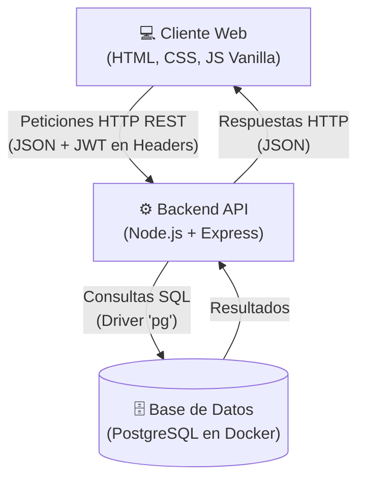
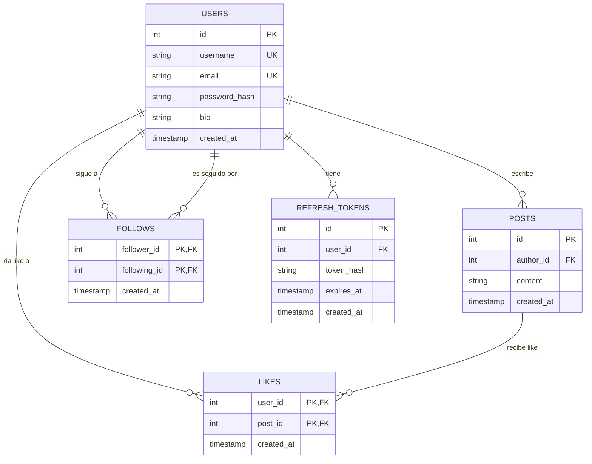

# Diagramas del Proyecto niko-net

## Diagrama de Arquitectura

```mermaid
flowchart TD
    Client["💻 Cliente Web\n(HTML, CSS, JS Vanilla)"]
    API["⚙️ Backend API\n(Node.js + Express)"]
    DB[("🗄️ Base de Datos\n(PostgreSQL en Docker)")]

    Client -- "Peticiones HTTP REST\n(JSON + JWT en Headers)" --> API
    API -- "Respuestas HTTP\n(JSON)" --> Client
    API -- "Consultas SQL\n(Driver 'pg')" --> DB
    DB -- "Resultados" --> API
```

## Diagrama de Base de Datos (Entidad-Relación)

```mermaid
erDiagram
    USERS ||--o{ POSTS : "escribe"
    USERS ||--o{ FOLLOWS : "sigue a"
    USERS ||--o{ FOLLOWS : "es seguido por"
    USERS ||--o{ LIKES : "da like a"
    POSTS ||--o{ LIKES : "recibe like"
    USERS ||--o{ REFRESH_TOKENS : "tiene"

    USERS {
        int id PK
        string username UK
        string email UK
        string password_hash
        string bio
        timestamp created_at
    }
    
    POSTS {
        int id PK
        int author_id FK
        string content
        timestamp created_at
    }
    
    FOLLOWS {
        int follower_id PK, FK
        int following_id PK, FK
        timestamp created_at
    }
    
    LIKES {
        int user_id PK, FK
        int post_id PK, FK
        timestamp created_at
    }
    
    REFRESH_TOKENS {
        int id PK
        int user_id FK
        string token_hash
        timestamp expires_at
        timestamp created_at
    }
```
